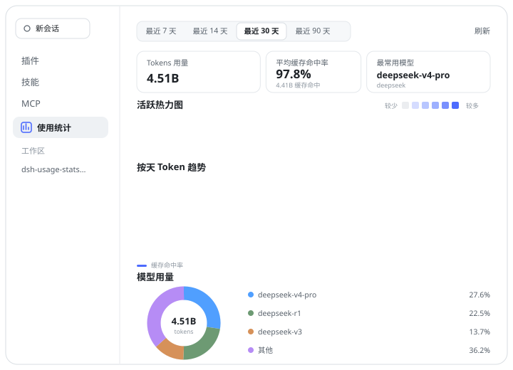
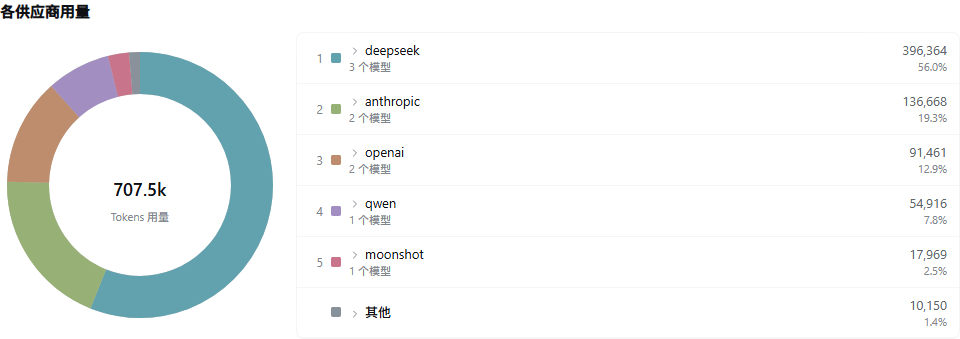

# DSH Usage Statistics Panel

[English](README_EN.md) | 中文

<p align="center">
  <picture>
    <source media="(prefers-color-scheme: dark)" srcset="docs/banner-zh-dark.svg">
    
  </picture>
</p>


[](https://awesome-dsh-plugin.com)
[](https://github.com/HaoyueQin/dsh-usage-statistics-panel/graphs/commit-activity)
[](https://github.com/HaoyueQin/dsh-usage-statistics-panel/commits)

DSH web 插件的用量统计面板：按天 Token 趋势、GitHub 风格活跃热力图、缓存命中率曲线、按模型与按供应商两种用量拆分（环形占比图 + 明细列表），作为**插件**页中本插件的独立页面，并在左侧栏提供独立入口。

所有图表均为手绘 SVG，不依赖图表库；配色使用 GitHub Primer 的 data-viz 双套色板（模型前 10 名、供应商前 5 名各取一个等级色，其余归入灰色 "Other" 桶），并随 DSH 主题自适应。

<p align="center">
  
</p>

## 预览

<p align="center">
  
</p>

<p align="center">
  
</p>

<p align="center">
  
</p>

## 功能

- **时间范围**：最近 7 / 14 / 30 / 90 天，或自定义起止日期
- **汇总卡片**：Token 用量、会话数量（完成的 turn）、请求数量、活跃天数、平均缓存命中率、最常用模型
- **52 周活跃热力图**：每日 token 用量的 GitHub 风格色阶，悬停查看当天明细；数据窗口固定为一年，列数随可用宽度自适应（窄窗口显示较少周数），图表始终左右撑满
- **按天 Token 趋势**：堆叠柱状图叠加平滑的缓存命中率曲线（Catmull-Rom 样条），悬停查看各模型拆分；宽度随容器自适应，始终左右撑满
- **模型用量**：环形占比图 + 明细列表，前 10 名模型分色，其余折叠为可展开的 "Other" 明细；圆环直径随可用宽度在 200–280px 间自适应，并与右侧清单垂直居中
- **供应商用量**：同一结构上移一层——前 5 名供应商分色（独立色板），其余归入灰色 "Other"；悬停任一侧联动另一侧，圆环悬停显示该供应商的全部模型用量；每行可展开该供应商的模型明细，"Other" 展开被折叠的供应商、其下再展开各自的模型（展开不影响圆环尺寸）
- **底部信息栏增强**：面板底部可开启"精确缓存命中率"（会话底部信息栏的缓存命中率以两位小数显示，如 85.25%）、"会话 Token 明细"（底部信息栏显示总 Token、输入、输入（命中缓存）、输入（未命中缓存）与输出 Token，替代默认的"输入/输出"两项）与"流式吞吐速度"（输出过程中速度读数随每个增量实时刷新为估算值，某一步结束后回到会话累计的精确值；估算以 DeepSeek 公布的字符密度为先验，再用本会话已结算步骤的实测字符/Token 比率校准，读数取最近 2 秒内实际观测到的 Token 增量并做平滑（单帧抖动不会传导到显示），UI 迟发的积压不会被计入，一步中途静默时保持最后一次读数而不是回落到会话平均值）；开关位于"使用统计"面板底部，三个开关同款样式，切换即时生效
- **历史回扫**：首次启用时枚举并回放既有会话日志；对挂载后才首次观测到的活跃会话，其挂载前的历史会在下一次启动时按事件序号边界回放补全，从安装日起尽量还原历史用量
- **本地持久化**：数据写入 `$DSH_HOME/storages/usage_history.json`（storage-domain），纯本地、无外部依赖

## 安装

```sh
dsh plugin --profile <name> add dsh-usage-statistics-panel@latest
```

装完**硬刷新浏览器**（Cmd/Ctrl+Shift+R）：client 半的改动 DSH 会热加载，无需重启；仅 host 半（采集/存储/路由）更新时需要重启 DSH。

插件挂载后有两个入口：左侧栏 **新会话** 下方的 **使用统计** 行（一眼可达），或在 **插件** 页里进入 **已安装** → `usage-statistics-panel` 的详情页（卡片标题是去掉前缀的短名，完整包名显示在其详情页）。两处渲染的是同一个面板；**独立面板左上角有返回按钮**，点击即回到进入它之前的界面（会话、插件页或其它面板）。

**兼容性**：本插件支持 DeepSeek Harness `>= 0.1.7-rc.1`；开发依赖与核验目标对齐宿主 `0.1.7-rc.2`，已在 `0.1.7-rc.2` 上核验，V3 / V4 会话日志兼容由单测覆盖，历史回扫双路径（`0.1.2-rc.1` 的 `list`+`inspect` 与 `0.1.3-alpha.*` 起的 `list`+`open`+分页 `read`+`close`）保留。

底部信息栏那一行按宿主容器自适应：`0.1.6-alpha.2` 起宿主把它放进与上下文占用环并排的 flex 行里（居中、间距、顶距与侧边距都由该容器负责），`0.1.6-alpha.1` 及以前它仍自持内容宽度、左右侧边距与 4px 顶距——同一份构建在两种宿主上都对齐。

> peer 依赖中的 `@deepseek-ai/*` 只表达能力下界（`>=0.1.7-rc.1` 是插件用到的最早接口面），并全部标记为 optional。按 semver 的预发布规则，该范围只匹配同一 tuple 的预发布版——`0.1.7-rc.2` 判为满足，而下一个预发布行（`0.1.8-rc.1`）仍判不满足——所以实际支持的宿主版本以本段说明为准，不依赖 npm 的 peer 校验。

> **旧宿主用户**：`0.1.6-alpha.2` 及更早的 DeepSeek Harness 请安装本插件 `0.3.0` 及之前的版本。宿主在 `0.1.7` 线把 `@deepseek-ai/dsh-client-ui-primitives` 的图标导出整体改为字重命名（`*Outline16` → `*OutlineRegular` / `*Medium`），两代导出名**无交集**：旧名在 `0.1.7+` 上解析为 `undefined`，会让底部信息栏渲染失败——一份构建无法同时服务两代。

## 数据来源

面板的数据采集是**观测式**的：插件订阅会话事件流（`session/event`）中的 `assistant/message` 与 `assistant/chunk`，提取 provider 上报的 token 用量（输入 / 输出 / 缓存读 / 缓存写），在**单个会话内**按 `(turn, step)` 去重（同一调用只计一次、保留先到的样本——两个官方适配器对流式采样与最终上报的数值完全一致；并发会话各自独立计数、互不吞样本）。模型归因优先取消息自带的 `source`（每次调用各自标注），缺失时回退到会话的路由折叠（`request/context` 事件或会话的 `requestContext()`），宿主重启后也不会落入 "(unknown)" 桶。首次启用时还会回扫既有会话日志补齐历史。

> 提示：Token 用量从插件启用（含回扫）之日起累计；更早的会话日志若无 provider 上报的用量数据，则无法回溯。

**子代理会话**：子代理是独立会话，其 token、请求与完成的轮次与顶层会话一并统计（实时采集覆盖全部会话事件流，重启后回扫同样覆盖子代理会话日志）；父会话仅收到子代理结果摘要，不会重复计入。子代理会话早期的请求标记（step/start）先于其路由事件写入日志，首个请求可能统计在 "(unknown)" 桶——请求总数不受影响。

**Token 口径**：汇总卡片与趋势图的 Token 总量为**服务商总口径**——未缓存输入 + 输出 + 缓存读 + 缓存写，与服务商账单面板一致（DeepSeek 会把 prompt 拆成输入/缓存读两个不相交的桶，简单相加会漏掉占大头的缓存部分）。平均缓存命中率以输入侧（命中 + 未命中）为分母，其中**未命中 = 未缓存输入 + 缓存写入**——与会话底部信息栏（官方 StatsLine 口径）完全一致，两处读数不会出现分歧；命中率卡片下方同时展示缓存命中的绝对 token 量。

**重建统计**：`POST /usage/api/reset`（与面板同源信任围栏保护）清空本地统计并按当前归因规则全量重放会话日志——用于历史数据损坏或归因规则升级后的重建。仍在进行中的会话以其重置时刻的日志长度为界：界内由重放重建、界外继续由实时采集，恰好各计一次。

## 开发

```sh
pnpm install
pnpm typecheck   # tsc --noEmit
pnpm test        # vitest
pnpm build       # tsc declarations + tsdown (host ESM + 双通道 client bundle)
```

## 设计与实现

- **Host 半**（`src/`）：`collector`（事件订阅 + 回扫折叠）、`store`（`usage_history` storage-domain）、`query`（范围聚合，翻译自 reasonix 的 query.go）、`routes`（`/usage/api` fenced JSON 路由，信任围栏与 `/api` 网关一致）
- **Client 半**（`src/client/`）：`UsageStatsPanel.tsx`（手绘 SVG 图表，移植自 reasonix 面板 + Primer 配色）、`locales`（en / zh / zh-TW）、`api`（`/usage/api` fetch 封装）
- **双通道打包**：`lib/client.js`（官方 profile 通道，bundle id = 包名）与 `lib/client-registry.js`（插件注册表通道，bundle id = manifest id）。harness 0.1.x 官方加载链只消费前者；后者为外部 registry 通道预留，当前无消费者
- 详细设计见 [docs/design.md](docs/design.md)

## 致谢

本面板是对 reasonix 用量统计功能的复刻移植：作者曾为 [DeepSeek-Reasonix](https://github.com/esengine/DeepSeek-Reasonix) 实现并贡献了该功能（PR [#7238](https://github.com/esengine/DeepSeek-Reasonix/pull/7238)、[#7503](https://github.com/esengine/DeepSeek-Reasonix/pull/7503)），本插件按 DSH 的插件规范将其移植到 DeepSeek Harness，前端图表大比例复用原实现，数据层则基于 DSH 的会话日志与 storage-domain 重新实现。

## Activity

[](https://gitstock.org/HaoyueQin/dsh-usage-statistics-panel)

## License

MIT
