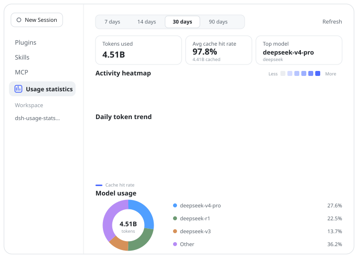
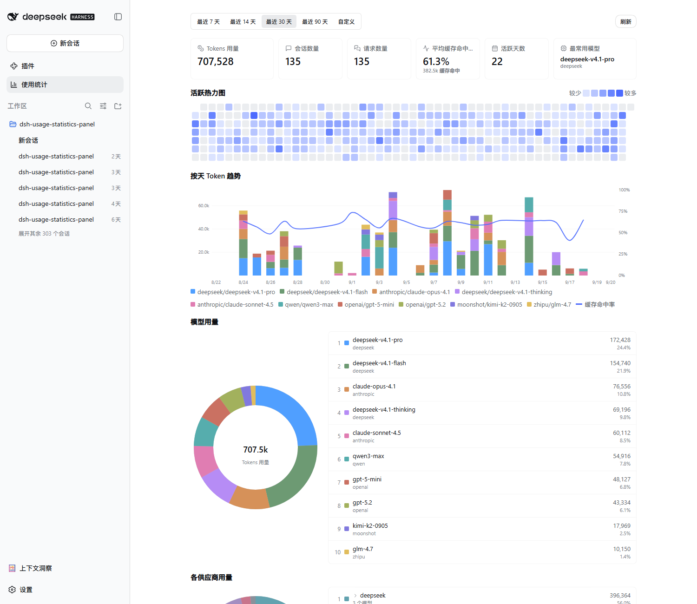
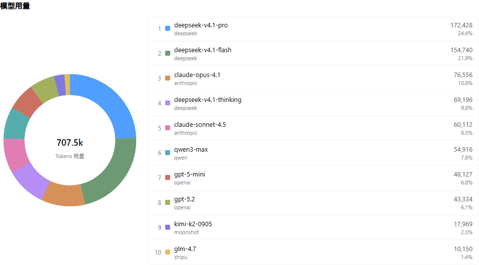

# DSH Usage Statistics Panel

English | [中文](README.md)

<p align="center">
  <picture>
    <source media="(prefers-color-scheme: dark)" srcset="docs/banner-dark.svg">
    
  </picture>
</p>


[](https://awesome-dsh-plugin.com)
[](https://github.com/HaoyueQin/dsh-usage-statistics-panel/graphs/commit-activity)
[](https://github.com/HaoyueQin/dsh-usage-statistics-panel/commits)

A usage statistics panel plugin for the DSH web UI: per-day token trend, a GitHub-style activity heatmap, a cache hit-rate curve, and a per-model breakdown (donut + list), added as a "Usage statistics" page in Settings.

All charts are hand-drawn SVG with no chart library; the palette uses GitHub Primer's data-viz two-set tokens (the top five models each get a distinct rank colour, everything else collapses into a gray "Other" bucket) and adapts to the DSH theme.

<p align="center">
  
</p>

## Preview

<p align="center">
  
</p>

<p align="center">
  
</p>

## Features

- **Time ranges**: last 7 / 14 / 30 / 90 days, or a custom from/to pair
- **Summary cards**: token usage, sessions (completed turns), requests, active days, average cache hit-rate, top model
- **26-week activity heatmap**: GitHub-style day cells, hover for the day's detail
- **Daily token trend**: stacked bars with a smooth cache hit-rate curve (Catmull-Rom), hover for the per-model breakdown
- **Model usage**: donut + list; the top five models keep distinct colours, the tail collapses into an expandable "Other" row
- **History backfill**: on first enable, the plugin enumerates and replays existing session logs; for a live session the collector attached to mid-flight, its pre-attachment history is recovered on the next boot by replaying the log prefix below the recorded seq boundary, so historical usage is accounted from day one as faithfully as the logs allow
- **Local persistence**: data lands in `$DSH_HOME/storages/usage_history.json` (storage-domain), fully local, no external services

## Install

```sh
dsh plugin --profile <name> add dsh-usage-statistics-panel@latest
```

After mounting, **hard-refresh the browser** (Cmd/Ctrl+Shift+R): client-half changes hot-reload in DSH, no restart needed; only host-half updates (collector/storage/routes) require restarting DSH.

Once mounted, a "Usage statistics" page appears in the left navigation of the Settings shell.

**Compatibility**: verified against DeepSeek Harness `0.1.1-rc.2` through `0.1.2-alpha.4` (peer declaration `^0.1.1-rc.2 || ^0.1.2-alpha.1`); CI regresses both `0.1.2-alpha.3` and `0.1.2-alpha.4` (`.github/workflows/test.yml`). Newer releases usually work but are unverified.

## Data source

The collector is observational: it subscribes to the session event stream (`session/event`), reads provider-reported `TokenUsage` from `assistant/message` and `assistant/chunk` (input / output / cache-read / cache-write), and dedupes by `(turn, step)` WITHIN one session (each call counts once, keeping the first report — the shipped adapters report identical values on the streaming sample and the final message; concurrent sessions never swallow each other's samples). Model attribution prefers the message's own `source` (stamped per call) and falls back to the session's route fold (`request/context` events or the session's `requestContext()`), so a host restart never drops samples into the "(unknown)" bucket. On first enable it also backfills by replaying persisted session logs.

> Note: usage accumulates from the day the panel is enabled (including the backfill). Sessions whose logs predate the feature carry no provider-reported usage and cannot be reconstructed.

**Token semantics**: the headline token total on the cards and in the trend is PROVIDER-INCLUSIVE — uncached input + output + cache reads + cache writes, matching what a provider dashboard reports for the same calls (DeepSeek splits prompt tokens into disjoint input/cache-read buckets, so a naive input+output sum would hide the typically dominant cached share). The average cache hit-rate keeps an input-side-only denominator (hits + misses), and the hit-rate card also shows the absolute cached volume; the two denominators never mix.

**Rebuilding stats**: `POST /usage/api/reset` (behind the same trust fence as the panel) wipes the local statistics and replays every persisted session log under the CURRENT attribution rules — the escape hatch for corrupted history or attribution-logic upgrades. Sessions still open at reset time are re-bounded at their wipe-time log length: everything below is rebuilt by the replay, everything after stays with the live collector, and nothing counts twice.

## Development

```sh
pnpm install
pnpm typecheck   # tsc --noEmit
pnpm test        # vitest
pnpm build       # tsc declarations + tsdown (host ESM + dual-channel client bundles)
```

## Design & implementation

- **Host half** (`src/`): `collector` (event subscription + backfill fold), `store` (the `usage_history` storage domain), `query` (range aggregation, a TS translation of the reasonix query.go), `routes` (the fenced `/usage/api` JSON routes, same trust fence as the `/api` gateway)
- **Client half** (`src/client/`): `UsageStatsPanel.tsx` (hand-drawn SVG charts ported from the reasonix panel + Primer palette), `locales` (en / zh / zh-TW), `api` (the `/usage/api` fetch wrapper)
- **Dual-channel bundles**: `lib/client.js` (official profile channel, bundle id = package name) and `lib/client-registry.js` (plugin-registry channel, bundle id = manifest id)
- Full design notes: [docs/design.md](docs/design.md)

## Acknowledgements

This panel is a port of the usage statistics feature the author originally built for [DeepSeek-Reasonix](https://github.com/esengine/DeepSeek-Reasonix) (PR [#7238](https://github.com/esengine/DeepSeek-Reasonix/pull/7238) and [#7503](https://github.com/esengine/DeepSeek-Reasonix/pull/7503)). The front-end charts are largely reused from that implementation; the data layer is rebuilt on DSH's session logs and storage-domain.

## Activity

[](https://gitstock.org/HaoyueQin/dsh-usage-statistics-panel)

## License

MIT
